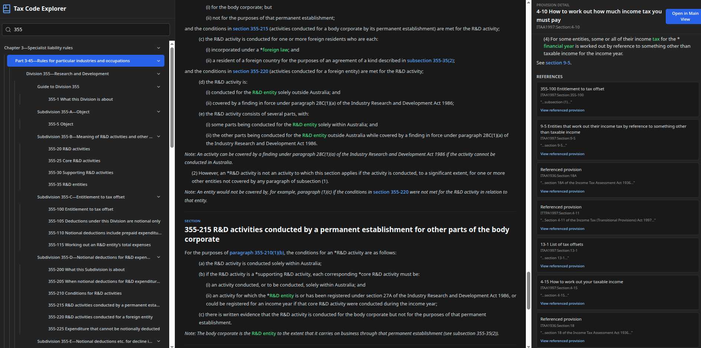

# Taxiv: Tax Code Explorer



A modern, interactive web application for browsing, analyzing, and understanding Australian tax legislation. This
project utilizes a sophisticated ingestion pipeline (Python, Gemini, NetworkX) to process legislation documents into a
structured database (PostgreSQL with LTree), served via a backend API (FastAPI) and visualized with a dynamic frontend (
React/TypeScript).

## Architecture

The project is structured as a multi-service application managed by Docker Compose:

* **Frontend (React/Vite):** A dynamic interface for navigating the tax code hierarchy.
* **Backend (FastAPI):** Serves the legislation data and handles API requests.
* **Database (PostgreSQL):** Stores the structured legislation, utilizing the `ltree` + `pgvector` extensions (the custom
  `Dockerfile.db` installs `postgresql-16-pgvector` so ANN search is available out of the box).
* **Ingestion (Python/Gemini):** A modular pipeline located in the `ingest/` directory for processing raw legislation
  documents.

## Setup and Running Locally

**Prerequisites:**

* Docker and Docker Compose
* A Google Gemini API Key (for the ingestion process)

### 1. Configuration

1. Clone the repository.
2. Ensure the `.env` file exists in the project root (refer to the provided `.env` structure).
3. **Set your `GOOGLE_CLOUD_API_KEY`** in the `.env` file.

### 2. Start the Infrastructure

From the project root, build and start the containers (this compiles the custom Postgres image with `pgvector` support):

```bash
docker-compose up --build -d
````

Verify the services are running. Ensure the `taxiv_db` service status eventually shows `(healthy)`.

```bash
docker-compose ps
```

### 3. Data Ingestion

To use the application, you must first ingest the legislation data.

**A. Place Input Files**

Place the raw DOCX files for the legislation into the corresponding data directory. For ITAA1997:

```
ingest/data/itaa1997/
    C2025C00405VOL01.docx
    ...
    C2025C00405VOL10.docx
```

**B. Run the Pipeline**

Execute the ingestion pipeline inside the running `backend` container. This process involves parsing the documents (
Phase A) and then analyzing/loading them into the database (Phase B).

```bash
docker-compose exec backend python -m ingest.pipelines.itaa1997.run_pipeline
```

> **Linux WMF/EMF note:** The ingestion pipeline now rasterizes Windows Metafile assets on Linux. Install
> `imagemagick`, `libwmf-bin`, and `librsvg2-bin` (or equivalent packages for your distribution) inside the backend
> environment so WMF/EMF images can be converted to PNG during parsing. The default `Dockerfile.backend` now installs
> these packages automatically; add them manually only if you run the ingestion pipeline outside that container.

This process may take time. Subsequent runs will be faster due to LLM caching (`ingest/cache/llm_cache.db`).

### 4\. Access the Application

* **Frontend:** `http://localhost:3000`
* **Backend API Docs (Swagger):** `http://localhost:8000/docs`

## Development Workflow

The Docker Compose setup enables live reloading for both the frontend (Vite HMR) and the backend (Uvicorn reload).
Changes made to the source code will be reflected automatically.

## SideNav Markdown Export

The SideNav includes contextual export controls that appear when you hover over or keyboard-focus a provision row. When
the controls are visible you can:

* **Copy** – Export only the selected provision.
* **Copy all** – Export the provision and all of its descendants in the hierarchy.

Each export opens a clipboard write request in the browser. Browsers require a user gesture (click or keyboard
activation) to grant clipboard permissions. If the permission request is denied, Taxiv reports the fallback state and
returns the generated markdown so the UI can offer a manual copy path (the default SideNav implementation surfaces an
inline status message).

### What the export contains

The backend assembles a complete markdown bundle for the provision before sending it to the clipboard. The export
contains:

1. **Copied nodes** – The node you selected and, when `Copy all` is used, every descendant provision.
2. **Referenced nodes** – Any provisions referenced by the copied set so cross-links resolve inline.
3. **Definitions used** – Definitions pulled in transitively for any defined terms found in the copied or referenced
   material.
4. **Unresolved external references** – A trailing list of cross-references that could not be resolved to provision IDs,
   including the snippet that triggered the reference when available.

### Walkthrough and extension points

1. Hover over a provision in the SideNav to reveal the copy buttons (or focus it with the keyboard and press `Tab`).
2. Choose **Copy** or **Copy all**. A spinner replaces the label while the export is running.
3. On success, a confirmation status appears beneath the node. If clipboard access is blocked, the status indicates the
   fallback so you can provide a manual copy surface via the `onClipboardFallback` callback if desired.

The export request is orchestrated in `utils/exportMarkdown.ts`, which handles clipboard permissions and provides hooks
for additional UI feedback. To adjust the structure of the generated markdown itself, modify
`backend/services/export_markdown.py`. Helper functions there (for example `_render_detail_block` and
`_collect_unresolved_references`) are the extension points for adding new sections or changing formatting rules.

### Troubleshooting

* **Clipboard permission denied:** Confirm the page is loaded over HTTPS (or `localhost`) and that the user initiated
  the
  export via a direct interaction. Browsers may require reloading the page after updating clipboard settings.
* **Backend export endpoint unavailable:** The SideNav export calls the `POST /api/provisions/export_markdown` endpoint.
  Ensure the backend container is running
  (`docker-compose ps`) and inspect the backend logs for errors (`docker-compose logs backend`).
* **Export succeeds but references are missing:** Verify that referenced provisions exist in the database. If the
  ingestion pipeline skipped source files, re-run `ingest.pipelines.itaa1997.run_pipeline` and confirm
  `backend/services/export_markdown.py` includes the desired section.
